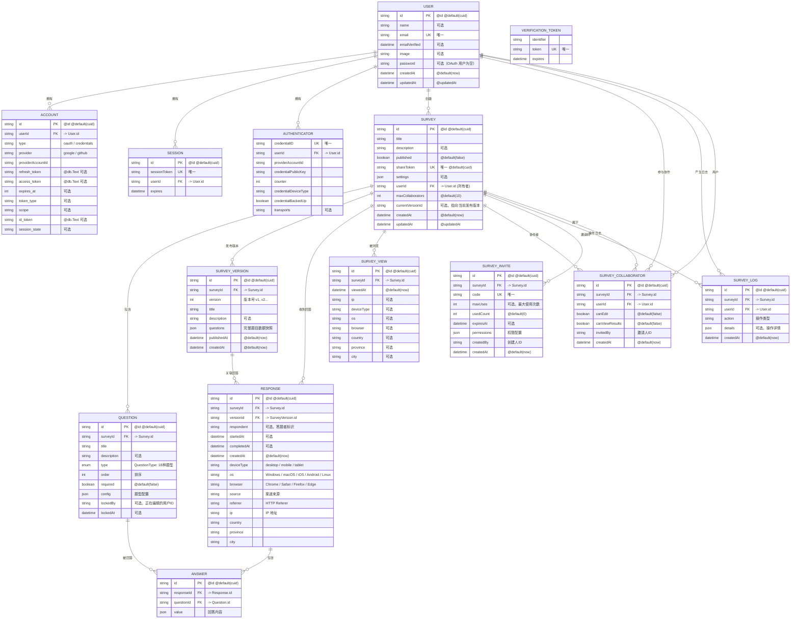

# 数据库 ER 图

## 问卷系统数据库实体关系图



## 关系说明

| 关系 | 类型 | 描述 |
|------|------|------|
| User → Account | 1:N | 一个用户可绑定多个 OAuth 账号 |
| User → Session | 1:N | 一个用户可有多个活跃会话 |
| User → Survey | 1:N | 一个用户可创建多个问卷 |
| User → SurveyCollaborator | 1:N | 一个用户可协作多个问卷 |
| User → SurveyLog | 1:N | 一个用户可产生多条操作日志 |
| User → Authenticator | 1:N | 一个用户可有多台认证设备 |
| Survey → Question | 1:N | 一个问卷包含多个题目 |
| Survey → SurveyVersion | 1:N | 一个问卷有多个历史版本 |
| Survey → Response | 1:N | 一个问卷收到多条回答 |
| Survey → SurveyView | 1:N | 一个问卷有多条浏览记录 |
| Survey → SurveyCollaborator | 1:N | 一个问卷有多个协作者 |
| Survey → SurveyInvite | 1:N | 一个问卷可生成多个邀请码 |
| Survey → SurveyLog | 1:N | 一个问卷有多条操作日志 |
| SurveyVersion → Response | 1:N | 一个版本关联多条回答 |
| Response → Answer | 1:N | 一条回答包含多个题目的答案 |
| Question → Answer | 1:N | 一个题目可被多次回答 |
| SurveyCollaborator | N:M 关联表 | Survey + User 的多对多关系，附带权限字段 |

## 索引说明

| 表 | 索引字段 | 用途 |
|----|----------|------|
| Survey | currentVersionId | 快速查询当前发布版本 |
| Question | lockedBy | 查询被锁定的题目 |
| Response | versionId, createdAt | 按版本和创建时间筛选 |
| SurveyCollaborator | surveyId, userId | 快速查询协作者 |
| SurveyInvite | surveyId, code | 按问卷和邀请码查询 |
| SurveyLog | surveyId, createdAt | 按问卷和时间查询日志 |
| SurveyVersion | surveyId, publishedAt | 按问卷和发布时间查询 |
| SurveyView | surveyId, viewedAt | 按问卷和浏览时间统计 |

## QuestionType 枚举

```
SINGLE_CHOICE, MULTIPLE_CHOICE, TEXT, RATING, DROPDOWN,
TEXTAREA, NUMBER, NPS, CES, PHONE, EMAIL, DATETIME,
RANKING, MATRIX_SINGLE, NAME, GENDER, BIRTHDAY,
IMAGE_SINGLE_CHOICE, IMAGE_MULTIPLE_CHOICE
```
