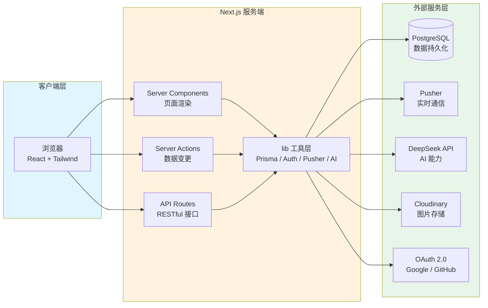
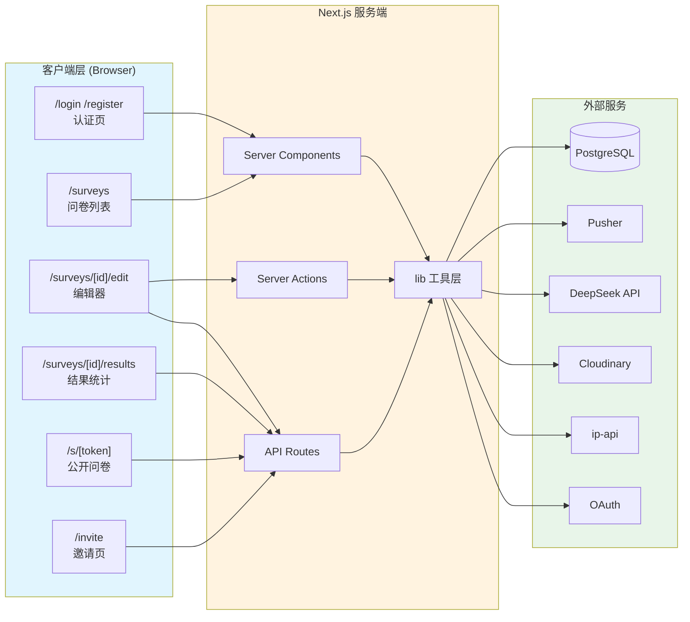

# 系统架构图

## Next.js 问卷系统架构（简洁版）

## 详细版（横向布局）

## 架构说明

| 层级 | 职责 | 关键技术 |
|------|------|----------|
| **客户端层** | 页面渲染、用户交互、状态管理 | React 19, Next.js App Router, Zustand, Tailwind CSS, shadcn/ui, ECharts |
| **服务端层** | 服务端渲染、业务逻辑、数据校验 | Next.js Server Components, Server Actions, Route Handlers, Zod |
| **工具层 (lib)** | 数据库访问、外部服务封装、通用逻辑 | Prisma, NextAuth, Pusher, AI SDK, Cloudinary SDK |
| **外部服务层** | 持久化存储、实时通信、AI 能力、文件存储 | PostgreSQL, Pusher, DeepSeek, Cloudinary, ip-api |

## 路由分组说明

| 分组 | 路径模式 | 用途 |
|------|----------|------|
| `(auth)` | `/login`, `/register` | 认证相关页面 |
| `(dashboard)` | `/surveys`, `/surveys/new`, `/settings` | 用户后台管理 |
| `(editor)` | `/surveys/[id]/edit`, `/surveys/[id]/results/*` | 问卷编辑与结果分析 |
| `s/` | `/s/[token]` | 公开问卷答题入口 |
| `invite/` | `/invite/[surveyId]/[code]` | 邀请链接处理 |
| `api/` | `/api/*` | RESTful API 端点 |
