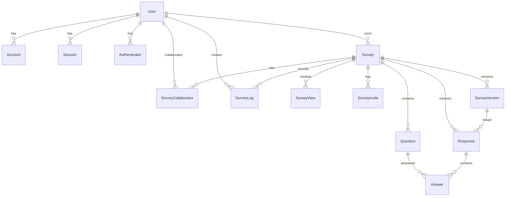

# 数据模型设计

## 模块概述

问卷系统采用 **PostgreSQL** 作为关系型数据库，通过 **Neon**（Serverless Postgres）托管。ORM 使用 Prisma，Schema 按业务域拆分为多个文件，便于维护。数据模型覆盖认证、问卷业务、版本管理、协作、日志统计五大领域。

---

## 数据库选型

| 技术 | 说明 |
|------|------|
| **PostgreSQL** | 主数据库，支持 JSON、Array、Enum 等丰富类型 |
| **Neon** | Serverless PostgreSQL 托管服务，按量计费，支持分支 |
| **Prisma** | ORM + 迁移工具，Schema 文件化，类型安全 |

Prisma 配置：

```prisma
// prisma/schema/schema.prisma
generator client {
  provider = "prisma-client-js"
  output   = "../generated/prisma"
}

datasource db {
  provider = "postgresql"
}
```

> 注意：Neon 的连接字符串通过环境变量 `DATABASE_URL` 提供，Prisma 在运行时读取。

---

## 关键文件说明

| 文件 | 职责 |
|------|------|
| `prisma/schema/schema.prisma` | Prisma 基础配置（generator、datasource） |
| `prisma/schema/auth.prisma` | 认证相关模型（User、Account、Session 等） |
| `prisma/schema/survey.prisma` | 问卷核心业务模型（Survey、Question、Response、Answer 等） |

---

## 模型关系图



---

## 认证相关模型

### User

```prisma
model User {
  id            String    @id @default(cuid())
  name          String?
  email         String    @unique
  emailVerified DateTime?
  image         String?
  password      String?   // 支持邮箱密码登录
  createdAt     DateTime  @default(now())
  updatedAt     DateTime  @updatedAt

  accounts       Account[]
  sessions       Session[]
  authenticators Authenticator[]
  surveys        Survey[]
  collaborations SurveyCollaborator[]
  surveyLogs     SurveyLog[]
}
```

**说明**：
- 基于 NextAuth.js v5 (Auth.js) 设计，支持 OAuth + 邮箱密码双轨认证
- `password` 字段为可选，OAuth 用户可为空
- 与 Survey 为一对多（用户可创建多个问卷）

### Account / Session / VerificationToken / Authenticator

标准 NextAuth 适配模型：

| 模型 | 用途 |
|------|------|
| **Account** | 第三方 OAuth 账号绑定（`provider` + `providerAccountId` 联合唯一） |
| **Session** | 会话管理（`sessionToken` 唯一） |
| **VerificationToken** | 邮箱验证/密码重置令牌 |
| **Authenticator** | WebAuthn / Passkey 凭证存储 |

```prisma
model Account {
  id                String  @id @default(cuid())
  userId            String
  type              String
  provider          String
  providerAccountId String
  refresh_token     String? @db.Text
  access_token      String? @db.Text
  // ...
  user User @relation(fields: [userId], references: [id], onDelete: Cascade)

  @@unique([provider, providerAccountId])
}
```

---

## 问卷核心模型

### Survey

```prisma
model Survey {
  id               String   @id @default(cuid())
  title            String
  description      String?
  published        Boolean  @default(false)
  shareToken       String   @unique @default(cuid())  // 分享链接令牌
  settings         Json?                              // 问卷设置（主题、逻辑跳转等）
  userId           String                             // 所有者
  maxCollaborators Int      @default(10)              // 最大协作者数
  currentVersionId String?                            // 当前发布的版本ID
  createdAt        DateTime @default(now())
  updatedAt        DateTime @updatedAt

  user          User                 @relation(fields: [userId], references: [id], onDelete: Cascade)
  questions     Question[]
  responses     Response[]
  views         SurveyView[]
  collaborators SurveyCollaborator[]
  invites       SurveyInvite[]
  logs          SurveyLog[]
  versions      SurveyVersion[]

  @@index([currentVersionId])
}
```

**关键字段说明**：

| 字段 | 说明 |
|------|------|
| `shareToken` | 唯一分享标识，用于生成公开填写链接（如 `/s/{shareToken}`），默认由 `cuid()` 自动生成 |
| `settings` | JSON 格式，存储问卷级配置：主题颜色、提交后跳转、逻辑规则、答题限制等 |
| `currentVersionId` | 指向当前已发布的 `SurveyVersion`，未发布时为 `null` |
| `maxCollaborators` | 限制协作者数量上限，默认 10 人 |

### Question

```prisma
model Question {
  id          String       @id @default(cuid())
  surveyId    String
  title       String
  description String?
  type        QuestionType // Enum
  order       Int
  required    Boolean      @default(false)
  config      Json?        // 题型专属配置
  lockedBy    String?      // 协作锁定：正在编辑的用户ID
  lockedAt    DateTime?    // 协作锁定：锁定时间

  survey  Survey   @relation(fields: [surveyId], references: [id], onDelete: Cascade)
  answers Answer[]

  @@index([lockedBy])
}
```

**关键字段说明**：

| 字段 | 说明 |
|------|------|
| `type` | 题型枚举，见下方 `QuestionType` |
| `config` | JSON 格式，按题型存储不同结构（选项、行列、评分范围等） |
| `order` | 题目在问卷中的显示顺序 |
| `lockedBy` / `lockedAt` | 实时协作专用字段，标记题目被谁锁定 |

**QuestionType 枚举**：

```prisma
enum QuestionType {
  SINGLE_CHOICE
  MULTIPLE_CHOICE
  TEXT
  RATING
  DROPDOWN
  TEXTAREA
  NUMBER
  NPS
  CES
  PHONE
  EMAIL
  DATETIME
  RANKING
  MATRIX_SINGLE
  NAME
  GENDER
  BIRTHDAY
  IMAGE_SINGLE_CHOICE
  IMAGE_MULTIPLE_CHOICE
}
```

### Response

```prisma
model Response {
  id          String   @id @default(cuid())
  surveyId    String
  versionId   String   // 关联到具体版本（版本化管理核心）
  respondent  String?  // 答题者标识（可选，如匿名则为 null）
  startedAt   DateTime? // 开始答题时间
  completedAt DateTime? // 提交时间（用于计算答题时长）
  createdAt   DateTime @default(now())

  // 设备/环境信息
  deviceType String? // desktop | mobile | tablet
  os         String? // Windows | macOS | iOS | Android | Linux
  browser    String? // Chrome | Safari | Firefox | Edge
  source     String? // 渠道来源参数
  referrer   String? // HTTP Referer
  ip         String? // IP 地址

  // 地域信息
  country  String?
  province String?
  city     String?

  survey  Survey        @relation(fields: [surveyId], references: [id], onDelete: Cascade)
  version SurveyVersion @relation(fields: [versionId], references: [id], onDelete: Cascade)
  answers Answer[]

  @@index([versionId])
  @@index([createdAt])
}
```

**说明**：
- 每份回答必须关联一个 `SurveyVersion`，确保问卷修改后历史数据仍可正确解析
- 设备与地域信息用于后续统计分析

### Answer

```prisma
model Answer {
  id         String @id @default(cuid())
  responseId String
  questionId String
  value      Json   // 答案值（按题型存储不同格式）

  response Response @relation(fields: [responseId], references: [id], onDelete: Cascade)
  question Question @relation(fields: [questionId], references: [id], onDelete: Cascade)
}
```

**`value` 字段存储格式**：

| 题型 | 存储格式示例 |
|------|-------------|
| 单选 / 下拉 / 性别 | `"option-id-123"` |
| 多选 / 图片多选 | `["opt-1", "opt-2"]` |
| 文本 / 邮箱 / 电话 | `"用户输入的文本"` |
| 数字 / 评分 / NPS | `42` |
| 矩阵单选 | `{ "row-1": "col-2", "row-2": "col-1" }` |
| 排序 | `["opt-3", "opt-1", "opt-2"]` |
| 日期时间 | `"2024-01-15T09:30:00.000Z"` |

> 使用 `Json` 类型存储答案值，兼顾灵活性和查询需求。统计查询时按 `question.type` 解析。

---

## 版本管理模型

### SurveyVersion

```prisma
model SurveyVersion {
  id          String   @id @default(cuid())
  surveyId    String
  version     Int      // 版本号 v1, v2, v3...
  title       String   // 发布时的标题快照
  description String?  // 发布时的描述快照
  questions   Json     // 完整的题目数据快照（含 config）
  publishedAt DateTime @default(now())
  createdAt   DateTime @default(now())

  survey    Survey     @relation(fields: [surveyId], references: [id], onDelete: Cascade)
  responses Response[]

  @@unique([surveyId, version])
  @@index([surveyId])
  @@index([publishedAt])
}
```

**设计说明**：
- 问卷发布时创建版本快照，`questions` 字段存储完整的题目数组 JSON
- 后续编辑不影响已发布版本，确保已收集的回答始终能对应到正确的题目结构
- `version` 为自增整数，便于用户理解（v1、v2）
- `Survey.currentVersionId` 指向最新发布的版本

---

## 协作模型

### SurveyCollaborator

```prisma
model SurveyCollaborator {
  id             String  @id @default(cuid())
  surveyId       String
  userId         String
  canEdit        Boolean @default(false)  // 是否可编辑
  canViewResults Boolean @default(false)  // 是否可查看结果
  invitedBy      String                    // 邀请人
  createdAt      DateTime @default(now())

  survey Survey @relation(fields: [surveyId], references: [id], onDelete: Cascade)
  user   User   @relation(fields: [userId], references: [id], onDelete: Cascade)

  @@unique([surveyId, userId])  // 每个用户对同一份问卷只有一个协作记录
  @@index([surveyId])
  @@index([userId])
}
```

**说明**：
- 细粒度权限控制：`canEdit` 控制编辑权限，`canViewResults` 控制结果查看权限
- 通过 `invitedBy` 追溯邀请链

### SurveyInvite

```prisma
model SurveyInvite {
  id          String    @id @default(cuid())
  surveyId    String
  code        String    @unique  // 邀请码
  maxUses     Int?               // 最大使用次数
  usedCount   Int       @default(0)
  expiresAt   DateTime?          // 过期时间
  permissions Json?              // 权限配置（canEdit, canViewResults）
  createdBy   String             // 创建人
  createdAt   DateTime  @default(now())

  survey Survey @relation(fields: [surveyId], references: [id], onDelete: Cascade)

  @@index([surveyId])
  @@index([code])
}
```

**说明**：
- 支持通过邀请码批量添加协作者
- `permissions` 为 JSON 格式，与 `SurveyCollaborator` 的权限字段对应

---

## 日志与统计模型

### SurveyLog

```prisma
model SurveyLog {
  id        String   @id @default(cuid())
  surveyId  String
  userId    String
  action    String   // 操作类型：CREATE / UPDATE / PUBLISH / DELETE 等
  details   Json?    // 操作详情（变更字段快照）
  createdAt DateTime @default(now())

  survey Survey @relation(fields: [surveyId], references: [id], onDelete: Cascade)
  user   User   @relation(fields: [userId], references: [id], onDelete: Cascade)

  @@index([surveyId])
  @@index([createdAt])
}
```

**说明**：
- 审计日志，记录问卷的关键操作
- `details` 可存储变更前后的字段值，便于追溯

### SurveyView

```prisma
model SurveyView {
  id         String   @id @default(cuid())
  surveyId   String
  viewedAt   DateTime @default(now())
  ip         String?
  deviceType String?
  os         String?
  browser    String?

  // 地域信息
  country  String?
  province String?
  city     String?

  survey Survey @relation(fields: [surveyId], references: [id], onDelete: Cascade)

  @@index([surveyId])
  @@index([viewedAt])
}
```

**说明**：
- 记录问卷被查看/打开的次数，用于统计曝光量
- 与 `Response` 区分：View 是打开，Response 是提交

---

## 索引设计

| 模型 | 索引字段 | 用途 |
|------|----------|------|
| **Survey** | `currentVersionId` | 快速查询当前发布版本 |
| **Question** | `lockedBy` | 协作场景：查询某用户锁定的所有题目 |
| **Response** | `versionId` | 按版本统计回答数 |
| **Response** | `createdAt` | 时间范围查询（如最近 7 天回答） |
| **SurveyCollaborator** | `[surveyId, userId]` (唯一) | 防止重复协作记录 |
| **SurveyCollaborator** | `surveyId` | 查询问卷的所有协作者 |
| **SurveyCollaborator** | `userId` | 查询用户参与的所有问卷 |
| **SurveyInvite** | `surveyId` | 查询问卷的所有邀请码 |
| **SurveyInvite** | `code` | 通过邀请码快速查找 |
| **SurveyLog** | `surveyId` | 查询问卷操作历史 |
| **SurveyLog** | `createdAt` | 按时间排序日志 |
| **SurveyVersion** | `[surveyId, version]` (唯一) | 确保版本号唯一 |
| **SurveyVersion** | `surveyId` | 查询问卷的所有版本 |
| **SurveyVersion** | `publishedAt` | 按发布时间排序 |
| **SurveyView** | `surveyId` | 统计问卷曝光量 |
| **SurveyView** | `viewedAt` | 按时间统计访问量 |

---

## 级联删除策略

所有与 `Survey` / `User` 关联的模型均设置 `onDelete: Cascade`，确保删除问卷或用户时自动清理关联数据：

```prisma
// 示例
user   User   @relation(fields: [userId], references: [id], onDelete: Cascade)
survey Survey @relation(fields: [surveyId], references: [id], onDelete: Cascade)
```

**级联路径**：
- 删除 **User** → 级联删除其 Account、Session、Authenticator、Survey、Collaborator、Log
- 删除 **Survey** → 级联删除其 Question、Response、View、Collaborator、Invite、Log、Version
- 删除 **Response** → 级联删除其 Answer

---

## 依赖

- `@prisma/client` — 运行时 ORM 客户端
- `prisma` — CLI 工具（迁移、生成、Studio）
- Neon PostgreSQL — 数据库托管
